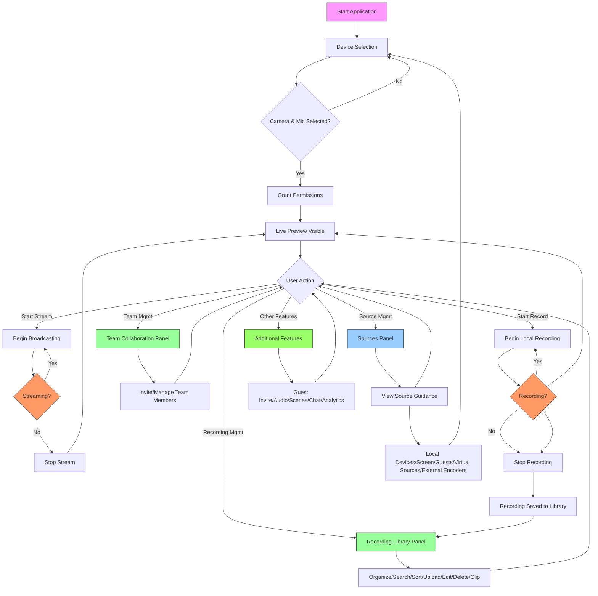

# LiveStream Platform User Guide & Workflow Documentation

## Overview
LiveStream Platform is a cloud-based live streaming application built with React/TypeScript and Cloudflare services. This guide explains how to use the platform end-to-end, including the recently implemented team collaboration and recording management features.

## Table of Contents
1. [Getting Started](#getting-started)
2. [Device Setup](#device-setup)
3. [Streaming Workflow](#streaming-workflow)
4. [Recording Workflow](#recording-workflow)
5. [Team Collaboration Features](#team-collaboration-features)
6. [Recording Management Enhancements](#recording-management-enhancements)
7. [Source Management Clarifications](#source-management-clarifications)
8. [Additional Features](#additional-features)
9. [End-to-End Workflows](#end-to-end-workflows)
10. [Flow Diagram](#flow-diagram)
11. [Troubleshooting](#troubleshooting)

---

## Getting Started
1. Open your browser and navigate to `http://localhost:3001`
2. The application will load and display the main interface
3. No login is required for local development (production would require authentication)

## Device Setup
Before streaming or recording, you must configure your audio/video devices:

1. In the **Video Preview** section (top-left):
   - Click the "Camera" dropdown and select your preferred camera
   - Click the "Microphone" dropdown and select your preferred microphone
   - Your browser will prompt for camera/microphone permissions - click "Allow"
   - You should now see a live preview of your video feed

> **Note**: Permissions are only requested when you first select a device, not on page load.

## Streaming Workflow
### Starting a Stream
1. Ensure both camera and microphone are selected and showing a preview
2. Click the **"Start Stream"** button (green) in the Video Preview controls
3. The button will change to "Streaming" and show a green indicator
4. Your stream is now live to connected platforms (configured in backend)
5. To stop streaming, click the **"Stop Stream"** button (red)

### Streaming Controls
- **Start Stream**: Begins broadcasting to configured platforms
- **Stop Stream**: Ends the broadcast
- Status indicators show when streaming is active (green) or inactive (red)

## Recording Workflow
### Recording Content
1. Ensure both camera and microphone are selected and showing a preview
2. Click the **"Start Recording"** button (blue) in the Video Preview controls
3. The button will change to "Recording" and show a blue indicator
4. Your session is now being recorded locally
5. To stop recording, click the **"Stop Recording"** button (red)
6. Recorded content will automatically appear in the Recording Library

### Recording Controls
- **Start Recording**: Begins local recording of your stream
- **Stop Recording**: Ends the recording and saves it to the library
- Status indicators show when recording is active (blue) or inactive (gray)

## Team Collaboration Features
*Located in the top-right sidebar*

### Viewing Team
- See current team members with their roles, status, and avatars
- Each member displays: Name, Email, Role badge, Status indicator, Avatar, Last seen timestamp

### Inviting Members
1. Enter team member's name in the "Team Member Name" field
2. Enter their email in the "Email Address" field
3. Select their role from the dropdown (Viewer, Editor, Admin, Owner)
4. Click "Invite Team Member" button
5. An invitation email will be sent (simulated in this version)

### Managing Members
- **Change Role**: Click on a member's current role badge (e.g., "VIEWER") to cycle through available roles
- **Remove Member**: Click the "×" button next to a member's name to remove them from the team

### Status Indicators
- **Green dot (●)**: Online - member is currently active
- **Yellow dot (○)**: Away - member is idle but available
- **Red dot (●)**: Offline - member is not currently connected
- **Last seen timestamp**: Shows when the member was last active

### Role Permissions
- **Owner**: Full access including billing and team management
- **Admin**: Can manage streams, recordings, and team members (except owners)
- **Editor**: Can manage streams and recordings but not team members
- **Viewer**: Can only view streams and recordings (no modifications)

## Recording Management Enhancements
*Located in the bottom-right sidebar*

### Organizing Recordings
1. **Filter by Folder**: Click folder buttons (Highlights, Tutorials, Archive) to show only recordings in that folder
2. **Search Recordings**: Use the search bar to find recordings by title or tags
3. **Sort Recordings**: 
   - Click sort options (Date, Duration, Size, Name) to change sort order
   - Click again to toggle between ascending/descending order
   - Current sort is indicated by arrow direction (↑/↓)

### Managing Recordings
1. **Upload Recording**: 
   - Click "Upload Recording" button
   - Fill in title, optional description, tags (comma-separated), and select folder
   - Choose a video file to upload
   - Click "Upload Recording" to complete
2. **Edit Recording**:
   - Click "Edit" on any recording
   - Modify title, tags (comma-separated), or folder assignment
   - Click "Save Changes" to confirm
3. **Delete Recording**:
   - Click "Delete" on any recording
   - Confirm deletion in the prompt
4. **Remove from Folder**:
   - Click "Remove from Folder" on a recording to take it out of its current folder
   - Recording will appear in "No Folder" view

### Creating Clips
1. Hover over any recording and click the "Clip" button (green scissors icon)
2. In the clipper interface:
   - Enter a clip title
   - Set start and end points by:
     * **Dragging timeline handles**: Click and drag the start/end markers on the timeline
     * **Using buttons**: Click "Set Start" or "Set End" at the current playback position
     * **Clicking timeline**: Click directly on the timeline to jump to that position
   - Add tags to describe the clip (comma-separated)
   - Click "Create Clip" to save the clip
3. Clips appear as separate entries in the recording library with a "clip" designation and can be managed like regular recordings

## Source Management Clarifications
*Located in Sources Panel (top-middle sidebar)*

To prevent confusion about different source types, the Sources Panel has been reorganized with clear guidance:

### Tab Organization
1. **"Local Devices" Tab** (Default)
   - For physical cameras, microphones, and screen sharing connected directly to your computer
   - Uses browser's `getUserMedia()` and `getDisplayMedia()` APIs
   - Includes: USB cameras, built-in laptop cameras, microphones, screen sharing

2. **"Guests" Tab**
   - For remote participants joining via LiveKit/WebRTC
   - Each guest appears as an incoming video/audio stream

3. **"Virtual Sources" Tab** (Informational)
   - **Phone cameras (EpocCam/iVCam/DroidCam)**: These apps create virtual webcam devices that appear in the "Local Devices" tab
   - **NDI sources**: Require NDI Tools' Virtual Input to appear as webcam options in "Local Devices"
   - **IP cameras**: Use virtual webcam software to convert IP camera feeds to webcam devices (then appear in "Local Devices")

4. **"External Encoders" Tab** (Informational)
   - **OBS/Ecamm Live/SRS**: Configure their RTMP output to point to your platform's ingest URL
   - **Important Note**: These are OUTPUTS from encoders, not INPUTS to our app
   - The encoder sends the stream TO our platform - our platform does not ingest arbitrary URLs
   - Configure your external encoder (OBS, VMix, Ecamm Live, hardware encoder, SRS, etc.) to send RTMP to the platform's ingest URL provided in your account settings

### Key Clarifications
- Phone apps like EpocCam create virtual webcam devices that appear in the "Local Devices" tab
- NDI sources require NDI Tools' Virtual Input to appear as webcam options
- To use OBS/Ecamm Live: Configure their RTMP output to point to your ingest URL
- These are OUTPUTS from encoders, not INPUTS to our app
- The encoder sends the stream TO our platform - our platform does not ingest arbitrary URLs

## Additional Features
### Guest Invitation (Top-middle sidebar)
- Invite guests to join your stream with limited permissions
- Manage guest permissions and remove guests as needed

### Audio Mixer (Top-middle sidebar)
- Adjust microphone input levels
- Mute/unmute your microphone
- Monitor audio levels in real-time

### Scene Manager (Top-middle sidebar)
- Switch between different stream layouts (e.g., camera only, screen share, picture-in-picture)
- Customize scenes with different sources and layouts

### Unified Chat (Top-middle sidebar)
- View messages from all connected platforms (YouTube chat, Twitch chat, etc.) in one feed
- Send chat messages that appear on all platforms
- Moderate chat with available tools

### Analytics Dashboard (Top-middle sidebar)
- **Viewer Statistics**: Current viewers, peak viewers, average view duration, total watch time
- **Platform Distribution**: Viewer count per platform (YouTube, Twitch, Facebook)
- **Engagement Metrics**: Chat messages, new followers, peak chat rate
- **Cost Analysis**: Estimated monthly costs for Stream, R2 storage, and Workers
- **Optimization Recommendations**: Personalized suggestions to reduce costs based on usage patterns

## End-to-End Workflows

### Workflow 1: Simple Stream and Record
1. Select camera/microphone → Grant permissions → See preview
2. Click "Start Stream" to begin broadcasting
3. Perform your stream content
4. Click "Stop Recording" to end local recording (if desired)
5. Click "Stop Stream" to end the broadcast
6. Find your recording in the Recording Library
7. Organize into appropriate folder (e.g., "Highlights")
8. Optionally create clips from key moments

### Workflow 2: Team-Based Production
1. Host invites team members via Team Collaboration panel:
   - Assign Editor role to graphics operator
   - Assign Admin role to moderator
   - Assign Viewer role to supervisor
2. Team members join with their respective permissions
3. Host manages stream start/stop and main content
4. Graphics operator manages scenes and overlays
5. Moderator monitors and manages chat via Unified Chat
6. Supervisor oversees the production without direct controls
7. After stream, team collaborates on:
   - Organizing recordings into folders
   - Creating highlight clips
   - Editing metadata for better discoverability

### Workflow 3: Content Repurposing
1. Record a long-form stream (e.g., tutorial, webinar)
2. Stop recording when finished
3. In Recording Library:
   - Search for recording by title/tags
   - Open clipper on the recording
   - Create multiple short clips from key sections
   - Add descriptive tags to each clip ("tutorial-intro", "main-topic", "q-a")
   - Organize clips into "Tutorials" folder
   - Share clips on social media or use as promotional content

## Flow Diagram

## Troubleshooting

### Common Issues
1. **No Video Preview**:
   - Ensure camera/microphone are selected in dropdowns
   - Check browser permissions (look for camera/mic icon in address bar)
   - Try selecting different devices

2. "LiveKit token not configured" Warning:
   - This is expected in development environment
   - Does not affect core functionality (team collaboration, recording management)
   - Related to WebRTC backend configuration for production

3. Recording Not Appearing in Library:
   - Ensure you clicked "Stop Recording" to finalize the recording
   - Check browser console for errors (F12 → Console tab)
   - Verify you have sufficient storage space

4. Team Invitations Not Working:
   - In development, invitations are simulated (no actual email sent)
   - Team members appear immediately in the list after clicking "Invite"
   - Check the team list below the form for new members

### Getting Help
- Check browser console (F12 → Console) for error messages
- Ensure you're using the latest version of Chrome, Firefox, or Safari
- For persistent issues, note the exact steps to reproduce and contact support

---
*Last updated: May 2026*
*Version: 1.0.0 - Includes team collaboration, recording management, and source management enhancements*
*Built with React, TypeScript, Tailwind CSS, and Cloudflare Services*